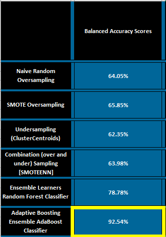

# Credit_Risk_Analysis

## Machine Learning using NumPy, Pandas, pathlib collections, imblearn and sklearn

## Purpose: This analysis is to employ different techniques to train and evaluated models with unbalanced classes to arrive at the best model for evaluating credit risk. Using imbalanced-learn and scikit-learn libraries, I build and evaluate six models:

#### ***Oversampling***
- Naive Random
- SMOTE

#### ***Undersampling***
- ClusterCentroids

#### ***Over and Under/Combination Sampling***
- SMOTEENN

#### ***Ensemble Learners***
- Random Forest Classifier
- Adaptive Boosting Classifier

### Results:

##### ***Balanced Accuracy Scores***: When comparing all models accuracy score, the most impressive score was the Adaptive Boosting Classifier (shown below).

#### ***Confusion Matrices Results***: When looking at the Confusion Matrices, again, the Adaptive Boosting Classifier module was most impressive. This is because true positive and true negative make up most of this sample. There are less than 1000 false positives and negatives to contend with.

#### ***Imbalance Classification Report***: When looking at the reports for each model, we find the largest number with the least distance between the two classes. Below we can see that that several of the models do have their highest percentages with the smallest distance in the recall column. these are definitely notable models. Once again though, the Adaptive Boosting Classifier would because because it meets the above model criteria best.

### Summary:

#### Since we are using these models for loan approvals, sensitivity is more important than precision. That is, it is more important to make sure banks protect themselves (and their potential customers) by not approving loans that will fail. The Adaptive Boosting Classifier model will protect a bank’s brand/reputation. Also, we aren't so concern about precision because, the bank has loan officer(s) that can review and approve a loan whose feature's value(s) have been deemed as high-risk.